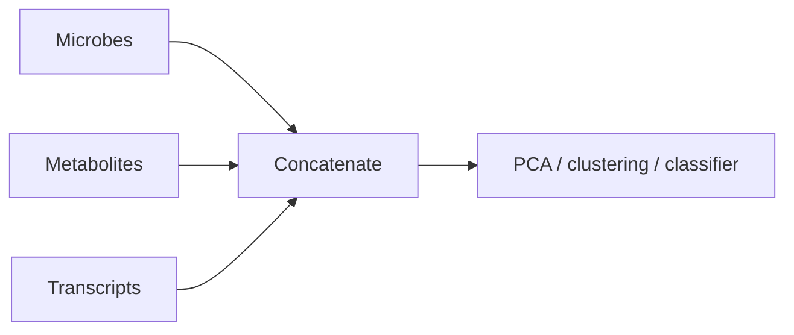
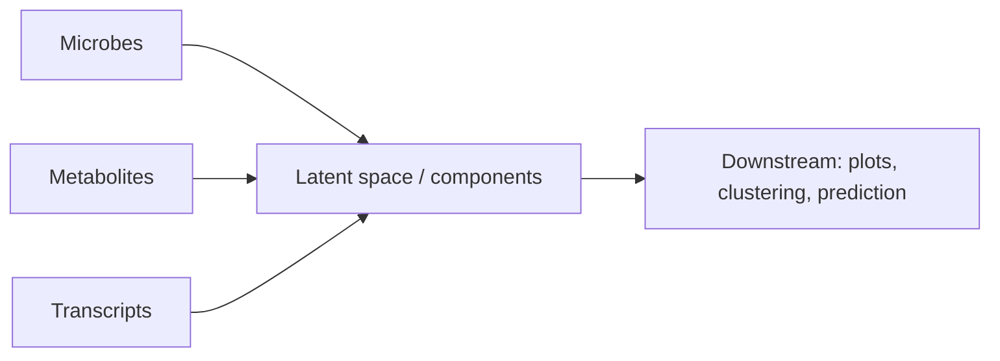
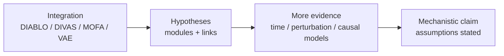

# Practical Multi-Omics Integration (DIABLO, DIVAS, VAEs + a few essentials)

A condensed-but-thorough, intuitive guide for people doing multi-omics (microbiome, metabolomics, transcriptomics, proteomics…) who want to integrate layers **without pretending correlation = causation**.

This repo covers:
- **DIABLO** (supervised multi-omics components + feature selection)
- **DIVAS** (shared-by-all vs shared-by-some vs unique structure)
- **Variational Autoencoders (VAEs)** for multi-omics embeddings and reconstruction (including label-conditioning)
- Related method families: **MOFA**, **JIVE**, **SNF**, **iCluster**, and baselines like **CCA / PLS / PCA**

We use one consistent toy example throughout (4 patients, 3 omics blocks, 1 group label) and define every term as we go.

## Quickstart

Python:
- Inspect toy data: `python python/01_make_toy_data.py`
- Early integration baseline (concat + PCA): `python python/03_baseline_concat_pca.py`
- Two-block baseline (microbiome ↔ metabolomics CCA): `python python/04_baseline_cca_microbe_met.py`
- Multi-omics latent demo (linear baseline; optional VAE with torch): `python python/02_multimodal_vae_skeleton.py`

Optional uv venv (nice for VS Code):
- `./scripts/uv_env.sh install-uv`
- `./scripts/uv_env.sh venv`
- `./scripts/uv_env.sh run python/03_baseline_concat_pca.py`

R:
- Inspect toy data: `Rscript r/01_make_toy_data.R`
- DIABLO mechanics demo: `Rscript r/02_diablo_mixomics_example.R` (requires `mixOmics`)

## Table of contents

- [0) Big picture: what integration can (and can't) do](#0-big-picture-what-integration-can-and-cant-do)
- [1) The toy example (used everywhere)](#1-the-toy-example-used-everywhere)
- [2) Core vocabulary (zero assumptions)](#2-core-vocabulary-zero-assumptions)
- [3) Three integration strategies (a simple map)](#3-three-integration-strategies-a-simple-map)
- [4) DIABLO (supervised multi-omics integration)](#4-diablo-supervised-multi-omics-integration)
- [5) DIVAS (shared-by-all vs shared-by-some vs unique)](#5-divas-shared-by-all-vs-shared-by-some-vs-unique)
- [6) VAEs for multi-omics (and label conditioning)](#6-vaes-for-multi-omics-and-label-conditioning)
- [7) Other method families (MOFA, JIVE, SNF, iCluster)](#7-other-method-families-mofa-jive-snf-icluster)
- [8) Choosing a method (what are you trying to do?)](#8-choosing-a-method-what-are-you-trying-to-do)
- [9) Practical workflow (before any model)](#9-practical-workflow-before-any-model)
- [10) How this helps you get closer to causal](#10-how-this-helps-you-get-closer-to-causal)
- [11) Further reading](#11-further-reading)

---

## 0) Big picture: what integration can (and can't) do

This section sets expectations: integration is powerful, but it is not a direction-or-causality engine.

Integration can:
- Find **shared patterns** across omics (features co-vary)
- Find **subtypes** (unsupervised clustering/embeddings)
- Build **predictors** of a group/outcome using multiple omics (supervised)
- Suggest plausible **mechanistic chains** for follow-up (hypothesis generation)

Integration cannot:
- Prove **direction** (microbe → metabolite vs metabolite → microbe)
- Prove **causality** by itself (confounding can still explain patterns)
- Replace experimental design (randomization, perturbations, time ordering)

Useful mental model:
- Integration = pattern-finding + compression
- Causal inference = what happens if we intervene?

---

## 1) The toy example (used everywhere)

This section defines the one dataset we reuse for every explanation.

We have 4 patients. For each patient we measure:
- **Block 1: Microbiome** (4 bugs; compositional)
- **Block 2: Metabolomics** (3 metabolites)
- **Block 3: Transcriptomics** (3 genes)
- **Group label** (0/1) for supervised examples

Data file: `data/toy_multiomics_4patients.csv`

### Microbiome block

| Patient | Bug A | Bug B | Bug C | Bug D |
|---|---:|---:|---:|---:|
| P1 | 0.10 | 0.60 | 0.20 | 0.10 |
| P2 | 0.15 | 0.55 | 0.20 | 0.10 |
| P3 | 0.40 | 0.20 | 0.25 | 0.15 |
| P4 | 0.45 | 0.15 | 0.25 | 0.15 |

### Metabolomics block

| Patient | Met 1 | Met 2 | Met 3 |
|---|---:|---:|---:|
| P1 | 1.0 | 0.2 | 0.7 |
| P2 | 1.1 | 0.2 | 0.6 |
| P3 | 2.0 | 0.5 | 0.4 |
| P4 | 2.1 | 0.6 | 0.3 |

### Transcriptomics block

| Patient | Gene 1 | Gene 2 | Gene 3 |
|---|---:|---:|---:|
| P1 | 5.0 | 2.0 | 1.0 |
| P2 | 5.1 | 2.1 | 1.0 |
| P3 | 6.5 | 3.0 | 0.8 |
| P4 | 6.7 | 3.2 | 0.7 |

### Group label

- P1, P2 = **Group 0**
- P3, P4 = **Group 1**

---

## 2) Core vocabulary (zero assumptions)

This section defines the words that show up in basically every integration paper.

### 2.1 Block / view / modality

A **block** (also called a *view* or *modality*) is one omics layer measured on the **same samples**.

Integration assumes aligned samples: “Patient P3” must mean the same person in every block.

### 2.2 Latent component / latent factor / embedding

A **latent** thing is “hidden”:
- you don’t measure it directly
- the method learns it as a compressed summary

Practical definition:

> A latent component is **one number per patient** summarizing a multi-feature pattern.

### 2.3 Supervised vs unsupervised

- **Supervised**: you have a target label/outcome and you want components that help predict it.
- **Unsupervised**: no labels; you want to discover structure.

### 2.4 Bias (plain language)

**Bias** = a systematically wrong conclusion that doesn’t go away with more data.

Common sources in integration:
- **Batch effects** (technical differences masquerading as biology)
- **Confounding** (a third thing drives multiple blocks)
- **Leakage** (label/test info sneaks into training and inflates performance)

### 2.5 Leakage (the most common “oops”)

Leakage examples:
- You pick features using all samples, then cross-validate on those same samples.
- You scale/normalize using all samples, then cross-validate.

Rule:

> Any preprocessing step that “looks at the data” should happen **inside** the cross-validation loop.

---

## 3) Three integration strategies (a simple map)

This section is the map. Most methods fall into one of these patterns.

### Strategy A: Early integration (concatenate features)

Combine blocks into one giant matrix and run one method.



Pros: simple.
Cons: scaling dominates; big blocks can drown small blocks.

### Strategy B: Intermediate integration (latent space integration)

Learn a shared (or partially shared) latent representation across blocks.



DIABLO / DIVAS / MOFA / JIVE / multi-modal VAEs live here.

### Strategy C: Late integration (combine results)

Analyze each block separately, then combine predictions or similarities.
SNF often feels like this (it fuses per-block similarity networks).

---

## 4) DIABLO (supervised multi-omics integration)

This section is for the “I have multiple omics and a label” situation.

DIABLO is a supervised integration method from `mixOmics` (R) designed for:
- multiple blocks measured on the same samples
- a label/outcome you care about (case/control, responder/non-responder)

DIABLO’s core question is:

> Which cross-omics feature patterns best separate the groups, while still agreeing across blocks?

### 4.1 Intuition: matching patterns across omics that separate groups

DIABLO tries to learn:
- **one component per block** (a weighted sum of features)
- such that **samples separate by group** along those components
- the block components are **aligned** (correlated)
- and only a **small subset of features** define each component (sparsity)

A mental picture:
- Microbiome component: “Bug A high, Bug B low”
- Metabolite component: “Met1 high, Met3 low”
- Transcript component: “Gene2 high”

…and DIABLO tries to make those move together across patients, while also separating Group 0 vs Group 1.

### 4.2 What DIABLO produces (what you interpret)

Most DIABLO workflows focus on:

1) **Sample scores** (per component, per block): where each patient sits
2) **Selected features / loadings**: which features define the signatures in each block
3) **Cross-block correlations**: whether the learned components align
4) **Predictive performance**: cross-validated accuracy/AUC (if you use it for classification)

### 4.3 Why feature selection matters

Without sparsity, components can be dense and hard to interpret.
With sparsity, you get:
- a short, interpretable multi-omics signature
- a manageable list of candidates for follow-up

### 4.4 What DIABLO is not

- It is not causal.
- It does not tell you which layer is upstream.
- It does not distinguish mediator vs confounder.

A good way to phrase what DIABLO answers is:

> What combination of features across omics best predicts group membership and is mutually consistent across blocks?

### 4.5 When DIABLO is a good choice

Use DIABLO when:
- you have a clear label/outcome
- you want a cross-omics signature (not separate per-omics hit lists)
- interpretability matters
- prediction and biological insight are both goals

Avoid (or be cautious) when:
- your goal is unsupervised discovery
- you want directionality/causal mechanism
- you suspect most structure is not shared across blocks

### 4.6 Practical pitfalls

- Leakage: tuning/feature selection on the full dataset, then reporting performance on the same dataset
  - if you tune, use nested cross-validation
- Batch effects aligned with group: DIABLO can rediscover batch as a “signature”
- Preprocessing choices (log transforms, scaling) can dominate results

### 4.7 Try it in this repo

- `Rscript r/02_diablo_mixomics_example.R` (requires `mixOmics`)

---

## 5) DIVAS (shared-by-all vs shared-by-some vs unique)

This section is about exploratory integration when you *don’t* want to assume every signal appears in every block.

Many integration methods implicitly assume:

> If there is a real signal, it should show up in every omics layer.

DIVAS (Data Integration via Analysis of Subspaces) is built around a different principle:

> Don’t force everything into one shared latent signal. First ask who shares what.

### 5.1 Intuition: decompose variation by who shares it

Given multiple blocks, DIVAS asks:
- which patterns are present in **all blocks**?
- which patterns are shared by **some blocks but not all**?
- which patterns are **unique** to a single block?

### 5.2 What you get out (how you use it)

DIVAS identifies directions/subspaces of variation characterized by which blocks they involve.
A practical workflow:

1) Project samples onto each discovered direction
2) See which patients score high/low
3) Inspect which features contribute (when available)
4) Treat “shared-by-some” structure as hypotheses (e.g., microbe–metabolite modules)

### 5.3 What DIVAS is not

- Not supervised (not designed for classification)
- Not inherently “a single best embedding”
- Not automatically mechanistic (shared structure can still be shared batch/confounding)

A good way to phrase what DIVAS answers is:

> How is variation distributed across omics layers: shared across all, shared across some, or unique?

### 5.4 When DIVAS is a good choice

Use DIVAS when:
- you want structure discovery without labels
- you suspect partial sharing across blocks
- you want to avoid forcing one shared latent signal

Avoid (or be cautious) when:
- your primary goal is prediction
- you need a single compact embedding for clustering
- you mainly want outcome-tied feature selection

### 5.5 Related method families

- MOFA: factors that can be shared or view-specific
- JIVE: explicit decomposition into joint + individual + residual

---

## 6) VAEs for multi-omics (and label conditioning)

This section is for nonlinear embeddings/reconstruction.

VAEs are a flexible way to learn nonlinear latent representations from high-dimensional data.
In multi-omics, they are often used to learn a shared embedding of samples from which each block can be reconstructed.

### 6.1 Start with the simplest intuition: compress → reconstruct

An autoencoder has:
- Encoder: compresses input features into a small latent vector
- Decoder: reconstructs the original features from that latent vector

If reconstruction is good, the latent space must capture important structure.

### 6.2 What makes it a VAE?

A VAE makes the latent space probabilistic and regularized.

Practical takeaway:
- the latent space is often smoother than in a plain autoencoder
- you can sample from the latent space (useful in some settings)

### 6.3 Multi-omics VAE (multi-modal VAE)

A common design:
- one encoder per block
- one shared latent space `Z` per patient
- one decoder per block

### 6.4 Conditional VAEs (including group labels)

Sometimes people feed the group label (Group 0/1) into the model.

This is useful for:
- group-conditional reconstruction/denoising
- conditional generation
- learning group-specific structure

Key interpretation trap:

> If you provide the label as input, “nice separation by group” is not necessarily a discovery — the model was told the group.

### 6.5 Trade-offs vs DIABLO / DIVAS

VAEs are powerful when:
- relationships are nonlinear
- features are high-dimensional and noisy
- you want an embedding for visualization/clustering or reconstruction/imputation

VAEs are a poor fit when:
- sample size is very small
- you need transparent, feature-level signatures
- you want something easy to tune and explain

### 6.6 Try it in this repo

- Runs without torch (linear shared-latent baseline): `python python/02_multimodal_vae_skeleton.py`
- Optional VAE training (requires torch): `python python/02_multimodal_vae_skeleton.py --vae`

---

## 7) Other method families (MOFA, JIVE, SNF, iCluster)

This section is a mental index: what each family tries to do and when it’s useful.

### MOFA
Unsupervised factor analysis across multiple omics.
Think: PCA-like factors, but probabilistic and can be shared or view-specific.

### JIVE
Decomposes each block into:
- Joint structure shared across blocks
- Individual structure unique to each block
- Residual noise

### SNF (Similarity Network Fusion)
Build a patient similarity network per block, fuse them, then cluster patients.
Best when your goal is patient subtyping.

### iCluster / iClusterPlus
Learns a shared latent space and clusters patients in that space.

### Baselines you should always know
- PCA (within each block)
- CCA / PLS (between blocks)
- Concatenate + PCA / classifier (often surprisingly strong if preprocessing is solid)

Try in this repo:
- `python python/03_baseline_concat_pca.py`
- `python python/04_baseline_cca_microbe_met.py`

---

## 8) Choosing a method (what are you trying to do?)

This table is the “start here” section.

| Goal | Supervised? | Good starting points | What you get |
|---|---:|---|---|
| Predict a group/outcome + pick cross-omics features | Yes | DIABLO | components + selected features + performance |
| Discover shared vs unique structure | No | DIVAS, JIVE, MOFA | shared vs view-specific factors |
| Patient subtyping via similarity | No | SNF | fused patient network + clusters |
| Integrative clustering | No | iClusterPlus | clusters + latent space |
| Nonlinear embedding / imputation | Maybe | multi-modal VAE | latent embedding + reconstructions |

---

## 9) Practical workflow (before any model)

This section is what you do before running any integration method.

1) Align samples across blocks (matching IDs)
2) Transform within each block (depends on data type)
   - Microbiome is compositional → prefer log-ratios (CLR/ALR)
3) Scale features (most latent methods are scale-sensitive)
4) Validate properly
   - supervised: cross-validation (nested CV if tuning)
   - unsupervised: stability checks (resampling)

---

## 10) How this helps you get closer to causal

This section explains how to use integration responsibly.

Integration can suggest a chain like:
- Bug A ↔ Met 1 ↔ Gene 2 ↔ phenotype

…but that’s still correlation structure.
To get closer to causality you usually need:
- time ordering (longitudinal)
- perturbations (interventions)
- causal models on top of the hypotheses (with assumptions stated)



## Final honesty check

- Integration ≠ causal.
- Nice separation in latent space ≠ biological truth.
- Conclusions are only as good as preprocessing, validation, and confounding control.

---

## 11) Further reading

These are good entry points for the specific methods discussed here.

- DIABLO: Singh et al., *Bioinformatics* (2019). “DIABLO: an integrative approach for identifying key molecular drivers from multi-omic assays.”
- DIVAS: Prothero et al. “Data Integration via Analysis of Subspaces (DIVAS)” (journal + arXiv).
- MOFA: Argelaguet et al., *Molecular Systems Biology* (2018). “Multi-Omics Factor Analysis (MOFA).”
- JIVE: Lock et al., *Annals of Applied Statistics* (2013). “Joint and Individual Variation Explained (JIVE).”
- VAE: Kingma & Welling (2013). “Auto-Encoding Variational Bayes.”

Copy/paste links:

```
DIABLO (Bioinformatics): https://academic.oup.com/bioinformatics/article/35/17/3055/5292387

DIVAS (Springer journal page): https://link.springer.com/article/10.1007/s11749-024-00923-z
DIVAS (arXiv):                https://arxiv.org/abs/2212.00703

MOFA (MSB paper page):        https://link.springer.com/article/10.15252/msb.20178124

JIVE (AoAS full text):        https://projecteuclid.org/journals/annals-of-applied-statistics/volume-7/issue-1/Joint-and-individual-variation-explained-JIVE-for-integrated-analysis-of/10.1214/12-AOAS597.full

VAE (Kingma & Welling arXiv): https://arxiv.org/abs/1312.6114
```

(These links are also in `docs/06_further_reading.md`.)
